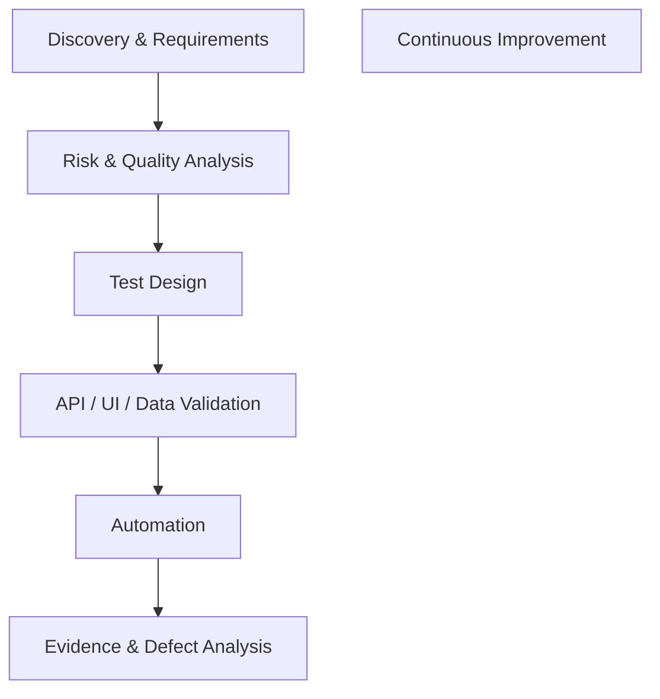

# Quality Engineering Lab

> An evolving Quality Engineering laboratory focused on risk-based testing,
> Shift-Left practices, API testing, test automation, performance engineering,
> and responsible AI-assisted workflows.

---

## What is this repository?

This repository is a practical Quality Engineering laboratory designed to
explore and demonstrate professional QA practices across different stages
of the software delivery lifecycle.

The laboratory focuses on developing a quality mindset that goes beyond
test execution, including:

- Understanding business context and requirements
- Identifying risks before implementation
- Designing tests based on business impact
- Validating APIs, UI behavior, and data
- Exploring test automation
- Applying performance engineering practices
- Using AI to support repetitive and analytical QA activities
- Verifying AI-generated output through human review and evidence

The repository is continuously evolving as new practices, tools, and
case studies are developed.

---

## Quality Engineering Approach

The laboratory follows an evidence-driven and risk-based approach to quality.

Rather than treating testing as a final verification phase, quality
activities are considered throughout the development lifecycle.

## Engineering Workflow

> The workflow is iterative rather than strictly sequential. Testing
> activities may return to previous stages when new risks,
> ambiguities, or defects are identified.

---

## Quality Engineering Principles

This laboratory is guided by the following principles:

- **Shift-Left Quality** — identify quality risks as early as possible.
- **Risk-Based Testing** — prioritize testing based on business and technical impact.
- **Evidence-Driven Decisions** — conclusions should be supported by observable evidence.
- **Exploratory Thinking** — actively investigate behavior that scripted tests may not cover.
- **Continuous Testing** — progressively integrate testing into the software delivery lifecycle.
- **Human-Verified AI** — AI-generated output is treated as a proposal, not as evidence.
- **Continuous Improvement** — use findings and lessons learned to improve the testing approach.

---

## AI-Assisted Quality Engineering

AI is used throughout the laboratory as an engineering assistant
rather than as a replacement for QA judgment.

Typical uses include:

- Requirement and specification analysis
- Identification of ambiguities and potential risks
- Test scenario generation
- Test case refinement
- BDD/Gherkin assistance
- Test automation assistance
- Documentation
- Code review and explanation
- Research and learning

**Core principle:** AI-generated output is a proposal, not evidence.
Any AI-generated test, assertion, analysis, or code must be reviewed
and validated before being considered reliable.

See the complete approach in [docs/ai-assisted-workflow.md](docs/ai-assisted-workflow.md).

---

## Technology Stack

**Collaboration & Project Management**
- GitHub
- Jira

**API Testing**
- Postman

**UI Automation**
- Playwright

**Performance Engineering**
- k6

**CI/CD**
- GitHub Actions

**AI-Assisted Engineering**
- Claude
- ChatGPT
- GitHub Copilot
- Postbot
- Gemini

> Tools are evaluated
    F --> G
    G --> B
