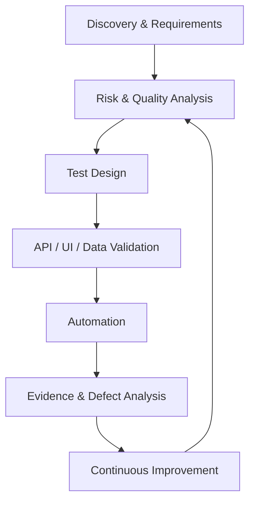

# Quality Engineering Lab

> An evolving Quality Engineering laboratory focused on risk-based testing,
> Shift-Left practices, API testing, test automation, performance engineering,
> and responsible AI-assisted workflows.

---

## What is this repository?

This repository is a practical Quality Engineering laboratory designed to
explore and demonstrate professional QA practices across different stages
of the software delivery lifecycle.

The laboratory focuses on developing a quality mindset that goes beyond
test execution, including:

- Understanding business context and requirements
- Identifying risks before implementation
- Designing tests based on business impact
- Validating APIs, UI behavior, and data
- Exploring test automation
- Applying performance engineering practices
- Using AI to support repetitive and analytical QA activities
- Verifying AI-generated output through human review and evidence

The repository is continuously evolving as new practices, tools, and
case studies are developed.

---

## Objectives

This laboratory aims to demonstrate professional Quality Engineering
practices beyond traditional software testing.

The main objectives are:

- Understand business domains before designing tests.
- Prevent defects through early collaboration.
- Apply Shift-Left Quality Engineering practices.
- Produce maintainable, evidence-driven documentation.
- Integrate AI responsibly throughout the SDLC.
- Continuously improve engineering and testing skills.

---

## Engineering Workflow

---

## Quality Engineering Principles

This laboratory is guided by the following principles:

- Shift-Left Quality — identify quality risks as early as possible.
- Risk-Based Testing — prioritize testing based on business and
technical impact.
- Evidence-Driven Decisions — conclusions should be supported by
observable evidence.
- Exploratory Thinking — actively investigate behavior that scripted
tests may not cover.
- Continuous Testing — progressively integrate testing into the
software delivery lifecycle.
- Human-Verified AI — AI-generated output is treated as a proposal,
not as evidence.
- Continuous Improvement — use findings and lessons learned to
improve the testing approach.

---

## Technology Stack

**Engineering Tools**

*Collaboration*
- GitHub
- Jira

*API Testing*
- Postman

*UI Automation*
- Playwright

*Performance*
- k6

*CI/CD*
- GitHub Actions

**AI-Assisted Workflow**

| AI              | Laboratory Role                                                 |
|------------------|------------------------------------------------------------------|
| Claude           | Simulated Product Owner, Business Analyst and Technical Writer   |
| ChatGPT          | Quality Engineering Lead, Reviewer and Coach                     |
| GitHub Copilot   | Pair Programmer                                                   |
| Postbot          | API Testing Assistant                                             |
| Gemini           | Research Assistant                                                 |

**Engineering Practices**

- Scrum
- BDD
- Shift-Left
- Risk-Based Testing
- Three Amigos
- Continuous Testing
- Test Automation
- Performance Testing

---

## Repository Structure
-Quality-Engineering-Lab/
-│
-├── docs/
-├── case-studies/
-│ ├── juice-shop/
-│ ├── refund-workflow/

---

## 🧪 Case Studies

### OWASP Juice Shop

Progress is updated incrementally as each sprint is completed.

- ✅ Business Discovery
- ⬜ Risk Analysis
- ⬜ Three Amigos
- ⬜ BDD
- ⬜ API Testing
- ⬜ UI Automation
- ⬜ Performance Testing

### Apache Fineract *(Coming Soon)*

---

## 🎯 Roadmap

Each sprint represents a professional learning milestone and
incrementally expands the laboratory capabilities.

- [ ] **Sprint 0** — Project Initialization
- [ ] **Sprint 1** — Business Discovery
- [ ] **Sprint 2** — Authentication
- [ ] **Sprint 3** — Shopping Experience
- [ ] **Sprint 4** — Order Processing
- [ ] **Sprint 5** — Performance Engineering
- [ ] **Sprint 6** — Continuous Quality

---

## 📖 Learning Journey

- Architecture Decision Records (ADR)
- Research Notes
- Lessons Learned
- Retrospectives
