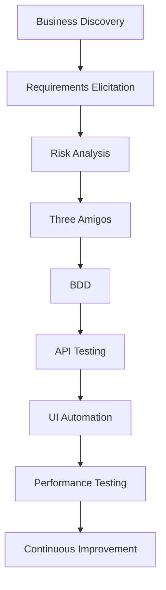

# Quality Engineering Lab

> A modern Quality Engineering portfolio focused on Shift-Left Testing,
> AI-assisted workflows, API Testing, BDD, Test Automation, and
> Performance Testing.

---

## What is this repository?

This repository documents a collection of real-world Quality Engineering
case studies, covering the complete software delivery lifecycle — from
product discovery and requirement analysis to API testing, automation,
performance testing, and continuous quality practices.

Each case study simulates a real Agile team, with defined roles,
structured workflows, and evidence-driven documentation — designed to
demonstrate not just *how to test*, but *how to think* as a Quality
Engineer across the entire SDLC.

---

## Objectives

This laboratory aims to demonstrate professional Quality Engineering
practices beyond traditional software testing.

The main objectives are:

- Understand business domains before designing tests.
- Prevent defects through early collaboration and requirement analysis.
- Apply Shift-Left Quality Engineering practices.
- Build maintainable and evidence-driven documentation.
- Integrate AI responsibly throughout the software delivery lifecycle.
- Continuously evolve technical and testing skills through real case studies.

---

## Engineering Workflow

---

## Quality Engineering Principles

This laboratory follows modern Quality Engineering practices:

- Shift-Left Testing
- Three Amigos Collaboration
- Business-Driven Development (BDD)
- Risk-Based Testing
- AI-assisted Quality Engineering
- Continuous Testing
- Evidence-driven Documentation

---

## Technology Stack

**Engineering Tools**

- GitHub
- Jira
- Postman
- Playwright
- k6
- GitHub Actions

**AI Collaborators**

| AI              | Laboratory Role                                                 |
|------------------|------------------------------------------------------------------|
| Claude           | Simulated Product Owner, Business Analyst and Technical Writer   |
| ChatGPT          | Quality Engineering Lead, Reviewer and Coach                     |
| GitHub Copilot   | Pair Programmer                                                   |
| Postbot          | API Testing Assistant                                             |
| Gemini           | Research Assistant                                                 |

**Engineering Practices**

- Scrum
- BDD
- Shift-Left
- Risk-Based Testing
- Three Amigos
- Continuous Testing
- Test Automation
- Performance Testing

---

## 🧪 Case Studies

### OWASP Juice Shop
- Business Discovery
- Risk Analysis
- BDD
- API Testing
- UI Automation
- Performance Testing

### Apache Fineract *(Coming Soon)*

---

## 🎯 Roadmap

Each sprint represents a professional learning milestone and
incrementally expands the laboratory capabilities.

- [ ] **Sprint 0** — Project Initialization
- [ ] **Sprint 1** — Business Discovery
- [ ] **Sprint 2** — Authentication
- [ ] **Sprint 3** — Shopping Experience
- [ ] **Sprint 4** — Order Processing
- [ ] **Sprint 5** — Performance Engineering
- [ ] **Sprint 6** — Continuous Quality

---

## 📖 Learning Journey

- Architecture Decision Records (ADR)
- Research Notes
- Lessons Learned
